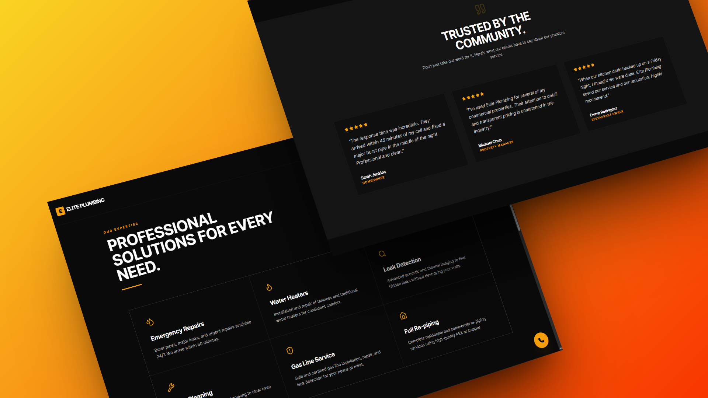
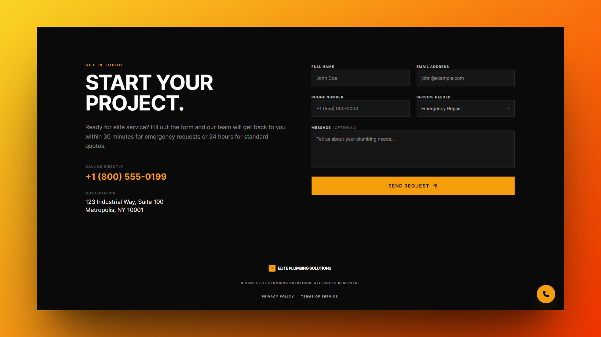

# Elite Plumbing Solutions

A single-page marketing site I designed and built for a plumbing company. It focuses on clear service presentation, fast contact, and a clean, modern feel.

---

## Showcase 

### Hero


### Services & Testimonials



### Contact



---

## Live Link

https://ionutrobert.github.io/elite-plumbing-solutions/

---

## What’s Inside

- Hero section with simple, direct CTAs
- Services grid with short, scannable descriptions
- Testimonial cards for social proof
- Sticky phone button on mobile for quick calls

---

## Tech Stack (short)

- React + TypeScript
- Vite
- Tailwind CSS
- motion (subtle animations)
- react-hook-form (contact form)

---

## Run Locally

```bash
npm install
npm run dev
```

---

## Notes

- Pure front-end; no backend or databases
- Built for portfolio/demo use and quick customization
